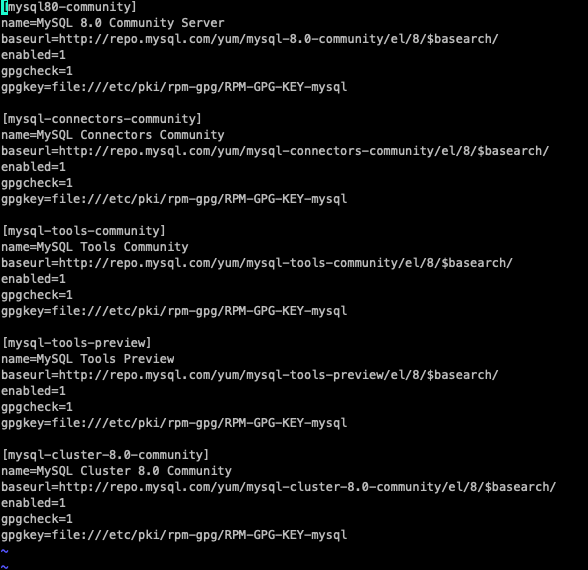
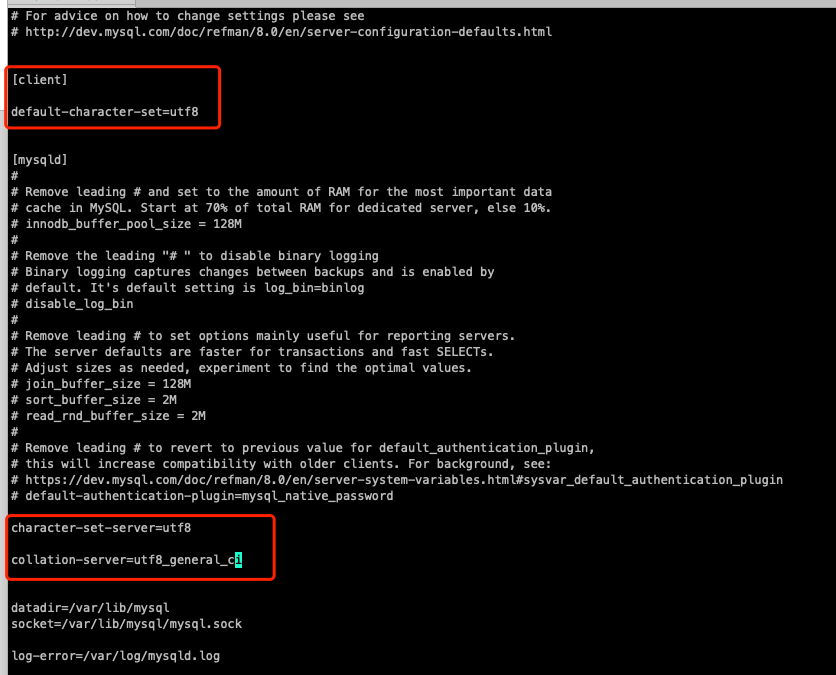

# Cetnos安装mysql 

## 准备： 

+ centos系统 
+ [在MySQL官网中下载YUM源rpm安装包](https://dev.mysql.com/downloads/repo/yum)：
`https://dev.mysql.com/downloads/repo/yum/  `

## 清理阶段： 

+ 卸载mysql： 

    `yum remove mysql-community-server`

+ 清理mysql其他相关包： 

    `rpm -qa | grep mysql`

    `yum remove mysql-xxx-xxx-`

+ 清理mysql其他相关文件/文件夹： 

    `find / -name mysql`

    `rm -rf xxxxxxx`

+ 卸载mariadb文件：

    `rpm -qa | grep mariadb`

    `rpm -e --nodeps mariadb-libs-5.5.56-2.el7.x86_64`

## 开始安装： 

+ 安装mysql下载仓库： 

    `rpm -ivh mysql80-community-release-el7-11.noarch.rpm`

+ 启用对应仓库（2个）：
    
    `vi /etc/yum.repos.d/mysql-community.repo`

    `vi /etc/yum.repos.d/mysql-community-source.repo`

    

+ 更新yum源

    `yum clean all && yum makecache`

+ 安装mysql

    `yum install mysql-community-server`

    > 如果报错找不到 `Error: Unable to find a match: mysql-community-server` 就， 
    先执行`yum module disable mysql` ， 在执行`yum install mysql-community-server`

+ 查看mysql状态

   `systemctl status mysqld.service` 

+ 启动/停止/重启mysql服务

    `systemctl start mysqld.service` 

    `systemctl stop mysqld.service` 

    `systemctl restart mysqld.service` 

+ 设置msyql开机自启动

    `systemctl enable mysqld.service`

+ 获取初始密码： 

    `cat /var/log/mysqld.log | grep password`

+ 登录： 

    `mysql -uroot -p`

+ 修改密码： 

    > mysql8.0版本必须符合长度（默认是8位），且必须含有数字，小写或大写字母，特殊字符。

    `mysql> ALTER USER 'root'@'localhost' IDENTIFIED BY '123456';`

+ 开启远程访问mysql ： 

    `mysql> grant all privileges on *.* to 'root'@'%' identified by '123456' with grant option;`

    `mysql> flush privileges;`

+ 设置简单密码： 
  
    `mysql> set global validate_password_policy=LOW;`
    `mysql> set global validate_password_length=6;`

+ 修改配置文件

    `vi /etc/my.cnf`

    

    > 改完之后需要重启mysqld `systemctl restart mysqld.service`  

## 开放3306接口： 

+ 查看已经开放的端口

    `firewall-cmd --list-ports`

+ 开启端口

    `firewall-cmd --zone=public --add-port=3306/tcp --permanent`

+ 重启firewall  

    `firewall-cmd --reload `

+ 停止firewall

    `systemctl stop firewalld.service`

+ 禁止firewall开机启动 

    `systemctl disable firewalld.service`        
