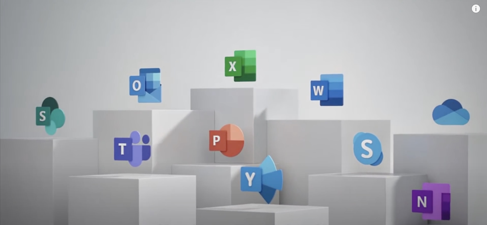

#  申请onedrive5T空间和OfficeA1Plus免费版 

> 本教程帮忙申请免费onedrive5T免费超大空间和Office A1-plus账号

>（感谢油管古奇哥）

废话不多说， 教程开始： 

首先，准备如下：（推荐使用chrome浏览器）
    将当前使用的浏览器的缓存全部清理完毕
    或准备一个全新的浏览器

## 1. 申请教育账号 - 通过yopmail中转

+ 打开这里[yopmail](http://www.yopmail.com/zh/​) 申请教育账号  `http://www.yopmail.com/zh/` 

+ 它是具有中转功能的email网站，会将域名转到ncov这种教育域名下，所以我们才能通过后面的校验。

+ 名称随便输入，如:[hayeslin2021]， 输入之后点击查看邮箱，到这里就根据你输入的的名字有了一个同名的ncov教育账号

+ 这个页面不要关闭， 待会用来接受验证码

## 2. 申请微软账号（A1）

+ 打开这里申请微软账号[微软账号](https://www.microsoft.com/zh-cn/education/products/office) `https://www.microsoft.com/zh-cn/education/products/office` 

+ 输入邮件地址[hayeslin2021@ncov.office.gy] **请注意这里的邮箱一定是@ncov.office.gy结尾**  点击确定按钮进行下一步

+ 选择 **我是学生**或者**我是老师** 都可以 

+ 输入账户信息， 用户名和密码可以随便输入。 

+ 验证码需要回到yopmail页面， 点击刷新，会收到邮件，点开就有验证码

+ 完成后点击开始<需要一点时间去注册>

+ 根据提示完成后进行重新登陆，需要验证**手机号码和邮箱**， 这里可以使用自己目前使用的手机号和邮件即可， 亲测大陆手机号可以通过， 当然，申请多个账号的时候可以使用同一个手机号和邮箱验证

+ 验证完成之后再次重新登陆。 进入页面说明微软账号申请成功。这里就是A1账号
    - 到这里进入账号查看onedrive就已经是5T空间了， 
    - 也可以直接在线使用Office， 但是不能下载安装包
     
## 3. 将A1升级到 A1 Plus

+ 账号升级到A1 Plus账号可以下载Office安装包，可以免费激活5台设备的Office， 包括电脑和手机版Office

+ 升级到A1 Plus只需要加入群组就可以了， 而且非常快速。 

+ 点击这里[加入群组](https://account.activedirectory.windowsazure.com/r#/groups) `https://account.activedirectory.windowsazure.com/r#/groups`  

+ 点击加入群组，加入「中国加油，河北加油」 这个群组， 如果没有可以使用右侧搜索 

## 4. 确定A1 Plus账号生效

+ 加入之后， 微软账号退出重新登陆一下（或者稍等片刻重新登陆） 

+ 查看已经是A1 Plus账号了。 

## 5. 下载Office2021年版本

+ 点击下载安装， 可以选择macos版本或者window版本

+ 注意⚠️macOS版是下载一个1.83G大小的安装包，下载速度取决于你的带宽。 

+ 注意⚠️window是下载一个几M的下载包， 然后安装的时候会在线下载安装，所以时间会更长一些， 一定要确保你的电脑全程联网。 

## 6. 安装与激活Office2021

+ 无论是macOS版本还是window版本， 下载完成后都会显示需要激活。 这个时候只需要登陆刚才申请的微软账号[hayeslin2021@ncov.office.gy](#)即可，   

+ 稍等片刻， 等待自动联网激活完成，就可以免费使用了。 

 
 
 
 

# 放在结尾， 如果你觉得写的不错，请收藏此网站， 并推荐给朋友 。 